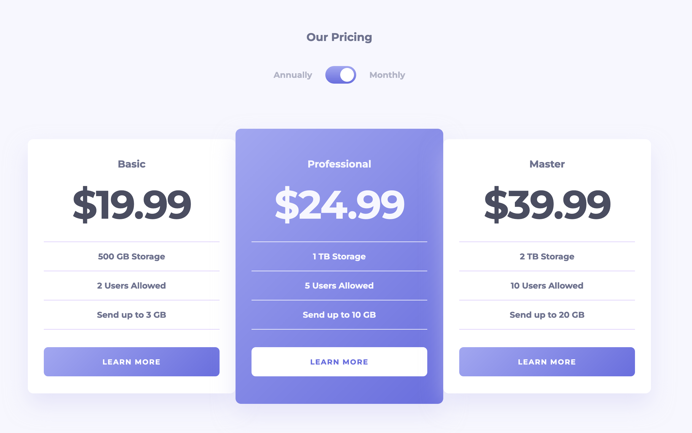

# Pricing component with toggle

## Table of contents

- [Overview](#overview)
  - [Links](#links)
  - [Screenshot](#screenshot)
- [My process](#my-process)
  - [Built with](#built-with)
  - [What I learned](#what-i-learned)
- [Author](#author)

## Overview

### Links

[Live Demo](https://aaronkagandev-pricingwithtoggle.netlify.app/)

### Screenshot



## My process

### Built with

- HTML
- CSS
- JavaScript

### What I learned

- Use of hidden elements that get shown by adding a class rather than adding the inner text via JS

```html
<h2 class="plan-price price-monthly">&dollar;19.99</h2>
<h2 class="plan-price price-annually hidden">&dollar;199.99</h2>
```

```css
.hidden {
  display: none;
}
```

```js
toggleSwitch.addEventListener('click', () => {
  planPricesMonthly.forEach((price) => price.classList.toggle('hidden'));
  planPricesAnnually.forEach((price) => price.classList.toggle('hidden'));
});
```

### Continued development

I plan to implement the following features:

- Use CSS Only (No JavaScript)
- User should be able to toggle with mouse and keyboard

<!-- ### Useful resources

- [Example resource 1](https://www.example.com) - This helped me for XYZ reason. I really liked this pattern and will use it going forward.
- [Example resource 2](https://www.example.com) - This is an amazing article which helped me finally understand XYZ. I'd recommend it to anyone still learning this concept. -->

## Author

- Portfolio - [aaronkagan.dev](https://www.aaronkagan.dev)
- X - [@aaronkagandev](https://www.twitter.com/aaronkagandev)
- Instagram - [aaronkagandev](https://www.instagram.com/aaronkagandev/)
